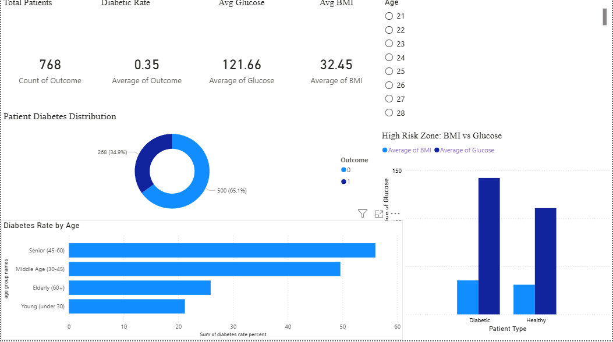

# diabetes-risk-analysis
End-to-end diabetes risk   │ │ prediction using Python, SQL &amp; Power BI
# 🏥 Diabetes Risk Prediction & Patient Analysis

## 📌 Project Overview
End-to-end data analytics project analyzing 768 patients
to predict diabetes risk using Machine Learning, SQL
Server, and Power BI.

## 🎯 Business Problem
Early diabetes detection can reduce hospital costs by 40%
and save thousands of lives annually. This project builds
a risk prediction system to flag high-risk patients early.

## 🛠️ Tools & Technologies
| Tool | Purpose |
|---|---|
| Python | Data cleaning, EDA, ML models |
| SQL Server | KPI queries, patient segmentation |
| Power BI | Interactive dashboard |
| GitHub | Version control |

## 📊 Key Results
- ✅ 79% model accuracy (Logistic Regression)
- ✅ Glucose identified as #1 risk factor
- ✅ Senior patients (45-60) at highest risk (58%)
- ✅ High risk zone: Glucose > 140 AND BMI > 30

## 🗂️ Project Structure
diabetes-risk-analysis/
├── data/
│   ├── raw/           ← original dataset
│   └── processed/     ← cleaned dataset
├── notebooks/         ← Python EDA + ML
├── sql/               ← KPI queries
├── dashboard/         ← Power BI file
├── images/            ← charts and screenshots
├── reports/           ← key insights
├── requirements.txt   ← Python libraries
└── README.md
## 📸 Dashboard Preview

## 🚀 How to Run
1. Clone this repository
2. Install libraries: `pip install -r requirements.txt`
3. Open `notebooks/diabetes_analysis.ipynb`
4. Run all cells top to bottom

## 📁 Dataset
- Name: Pima Indians Diabetes Dataset
- Source: UCI Machine Learning Repository
- Size: 768 patients, 9 columns

## 👤 Author
Dharshan C
Student | Data Analytics
LinkedIn: www.linkedin.com/in/dharshan-c-b69121330
